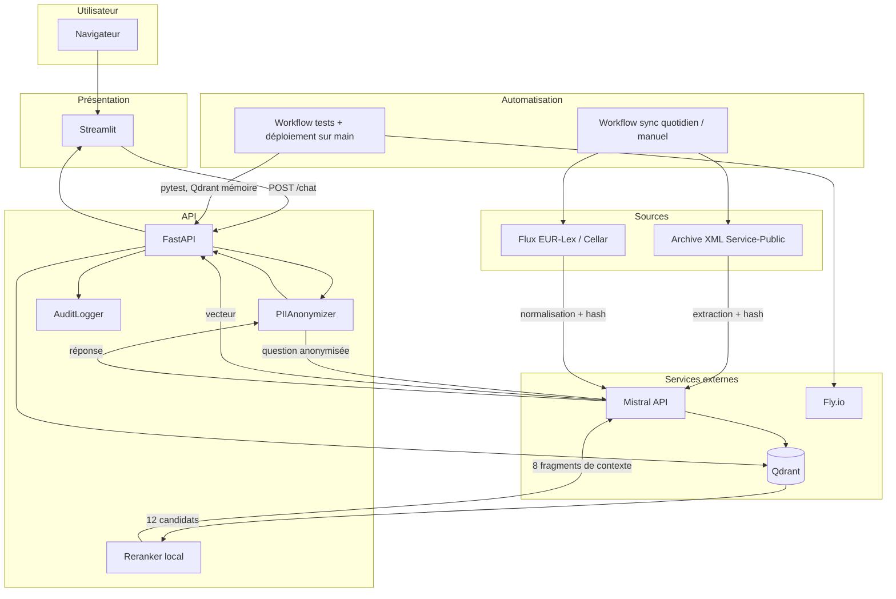
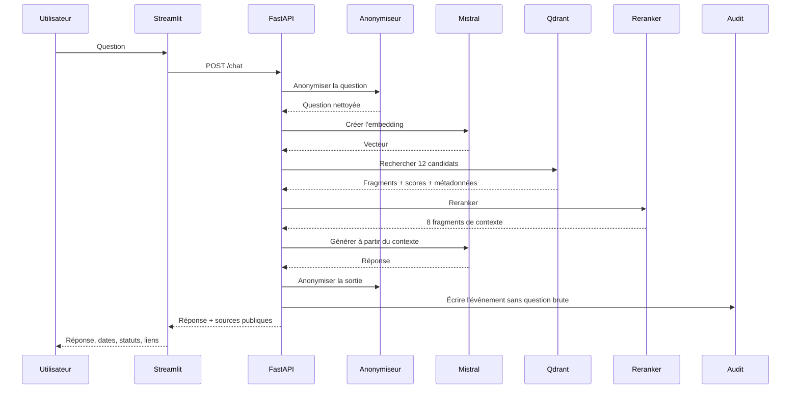

# Architecture générale

## Vue fonctionnelle

## Vue du parcours d'une question

## Composants

| Composant | Responsabilité | Fichier principal |
|---|---|---|
| Streamlit | Saisie, réponse, avertissements et sources | `frontend/streamlit_app.py` |
| FastAPI | Contrats HTTP et orchestration | `services/main.py` |
| PIIAnonymizer | Masquage e-mails, téléphones et NER optionnel | `services/pii.py` |
| MistralClient | Embeddings, génération et retries | `services/llm.py` |
| QdrantStore | Stockage, recherche, hash et suppression | `services/qdrant_store.py` |
| Reranker | Combinaison score vectoriel / mots-clés | `services/reranker.py` |
| AuditLogger | Trace JSONL sans question brute | `services/audit.py` |
| Service-Public | Téléchargement, extraction et sync | `scripts/*service_public.py` |
| EUR-Lex | Lecture du flux et sync différentielle | `scripts/legal_feed_eurlex.py`, `scripts/sync_legal_feed.py` |
| GitHub Actions | Tests, déploiements et synchronisations | `.github/workflows/*.yml` |

## PowerPoint et Mermaid

Le diagramme PowerPoint est utile pour la présentation et les vues détaillées. Mermaid sert de vue de référence versionnée avec le code. Les deux doivent rester cohérents, sans chercher à dupliquer toutes les slides dans Markdown.
