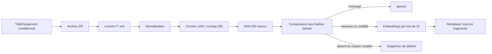

# Pipeline Service-Public

## Flux



## Téléchargement

`scripts/download_service_public.py` utilise l'ETag et conserve une archive locale et un manifeste dans `data/raw/service-public/`.

## Extraction

`scripts/extract_service_public.py` :

- sélectionne les fichiers `F*.xml` ;
- limite le nombre et la taille des fichiers traités ;
- exige une racine `Publication` ;
- lit `Introduction`, `ListeSituations` et `Texte` ;
- normalise les espaces ;
- découpe le contenu ;
- produit un SHA-256 de la source.

Une marque de version d'extracteur est ajoutée au hash pour les fiches utilisant le bloc `Texte`, afin de forcer leur réindexation après correction du parseur.

## Métadonnées

Chaque fragment contient :

- `document_id` ;
- `chunk_index` ;
- `title` ;
- `url` ;
- `modified_at` ;
- `effective_at` ;
- `status` ;
- `source_hash` ;
- `text`.

Pour Service-Public, `effective_at` est actuellement `None` et `status` vaut `published`.

## Synchronisation

```bash
python -m scripts.sync_service_public
```

Test limité :

```bash
python -m scripts.sync_service_public --limit 10
```

La suppression des fiches absentes n'est effectuée que lors d'une synchronisation complète, sans `--limit` et avec `offset=0`.

## Identifiants Qdrant

Les fragments utilisent un UUIDv5 construit à partir de :

```text
source:document_id:chunk_index
```

L'identifiant est stable entre deux synchronisations.
