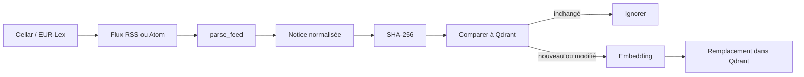

# Pipeline EUR-Lex / Cellar

## État actuel

Le connecteur est fonctionnel pour les notices du flux RSS ou Atom. Il ne constitue pas encore un extracteur complet de textes juridiques.

## Flux



## Fenêtre de récupération

Sans `EURLEX_FEED_URL`, le connecteur construit une requête sur les sept derniers jours vers le canal d'ingestion Cellar.

## Métadonnées normalisées

- identifiant dérivé du GUID, ID ou URL ;
- titre ;
- URL ;
- date de publication ou de mise à jour ;
- date d'entrée en vigueur lorsqu'elle est présente ;
- statut `published` ;
- résumé ou contenu présent dans la notice ;
- hash SHA-256.

## Synchronisation

```bash
python -m scripts.sync_legal_feed
```

Test limité :

```bash
python -m scripts.sync_legal_feed --limit 10
```

La source Qdrant utilisée est `eurlex-rss`.

## Limite majeure

Le champ `text` est actuellement composé du titre et du résumé éventuel de la notice. Le pipeline ne télécharge pas systématiquement le contenu complet du règlement ou de la directive pointé par l'URL.

## Prochaine évolution recommandée

1. résoudre l'identifiant CELEX ;
2. choisir un format officiel stable, par exemple HTML ou XML ;
3. télécharger le texte complet ;
4. extraire les articles et annexes ;
5. découper par structure juridique ;
6. conserver langue, type d'acte, CELEX et état de vigueur ;
7. ajouter des tests de non-régression sur plusieurs familles d'actes.
