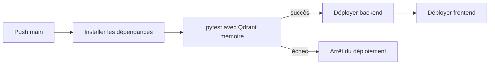

# CI/CD et automatisation

## Push sur `main`

Workflow : `.github/workflows/fly-deploy.yml`

### Tests

- Ubuntu ;
- Python 3.13 ;
- installation de `requirements.txt` ;
- `python -m pytest -q` ;
- Qdrant en mémoire.

### Déploiement

Le job `deploy` dépend du job `test`.

Applications :

- backend : `projet-fullstack` ;
- frontend : `trustrag-frontend`.

Secrets :

- `FLY_API_TOKEN_BACKEND` ;
- `FLY_API_TOKEN_FRONTEND`.

## Synchronisation quotidienne

Workflow : `.github/workflows/sync-feeds.yml`

Déclencheurs :

- cron quotidien à `02:17 UTC` ;
- lancement manuel avec `workflow_dispatch`.

Étapes :

1. installer les dépendances ;
2. synchroniser Service-Public ;
3. synchroniser EUR-Lex.

Les secrets Mistral et Qdrant sont injectés séparément dans chaque étape.

## Conséquences

- aucun déploiement si les tests échouent ;
- backend et frontend restent déployables séparément ;
- les corpus sont mis à jour sans modifier le code ;
- seules les nouveautés ou modifications déclenchent des embeddings.

## Points de vigilance

- la synchronisation n'est pas précédée par la suite de tests dans son propre workflow ;
- une erreur Service-Public empêche l'étape EUR-Lex ;
- aucun artefact de rapport n'est conservé ;
- aucun mécanisme de notification n'est défini ;
- la concurrence de déploiement utilise un groupe unique.
