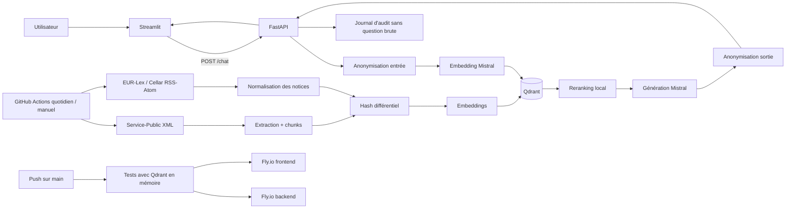

# TrustRAG-CX

Assistant RAG consacré aux droits, démarches administratives françaises et sources juridiques officielles.

Le système combine :

- un frontend Streamlit ;
- une API FastAPI ;
- des embeddings et une génération Mistral ;
- une base vectorielle Qdrant ;
- un reranking local explicable ;
- deux pipelines d'alimentation : Service-Public et EUR-Lex / Cellar ;
- une synchronisation différentielle automatisée ;
- une CI/CD GitHub Actions vers deux applications Fly.io séparées.

> **Référence documentaire** — Version 3 établie le 23 juillet 2026 à partir de l'archive fournie après mise à jour de `main` (commit `00ae192` indiqué par le contributeur), du `readme.md`, du code et de la synthèse d'avancement communiquée par Cédric. Les comportements visibles dans le code sont distingués des résultats d'exécution déclarés par l'équipe.

## État synthétique

| Domaine | État |
|---|---|
| Service-Public | Téléchargement conditionnel, extraction XML, chunking, hash et synchronisation différentielle |
| EUR-Lex / Cellar | Connecteur de notices RSS/Atom, normalisation des métadonnées et synchronisation différentielle |
| RAG | Embedding Mistral, recherche Qdrant, reranking hybride, génération contrainte par contexte |
| Métadonnées | URL, date de modification, date d'entrée en vigueur, statut et identifiant de document |
| Confidentialité | Anonymisation avant et après génération ; logs sans question brute |
| Backend | FastAPI, routes de santé, chat, indexation et suppression administrative ciblée |
| Frontend | Streamlit, bandeau IA, disclaimer juridique, dates et statuts des sources |
| Tests | 26 tests présents ; `26 passed` communiqué par l'équipe |
| CI/CD | Tests sur chaque push `main`, puis déploiements backend et frontend Fly.io |
| Synchronisation | Workflow quotidien et déclenchement manuel Service-Public + EUR-Lex |
| Historique permanent | Non implémenté ; échanges temporaires dans la session Streamlit |

## Architecture en une vue



Le schéma Mermaid est la vue maintenable dans GitHub. Le schéma PowerPoint peut rester la vue détaillée utilisée en présentation.

## Démarrage local

```bash
python -m venv .venv
source .venv/bin/activate
python -m pip install -r requirements.txt
cp .env.example .env
python -m uvicorn services.main:app --reload
```

Dans un second terminal :

```bash
source .venv/bin/activate
python -m streamlit run frontend/streamlit_app.py
```

- API : `http://localhost:8000`
- Swagger : `http://localhost:8000/docs`
- Streamlit : `http://localhost:8501`

## Tests

```bash
python -m pytest -q
```

Le dépôt contient 26 fonctions de test. L'équipe a communiqué un résultat local de `26 passed`. La CI configure `QDRANT_URL=:memory:` afin de ne pas dépendre de Qdrant Cloud pendant les tests.

## Documentation

1. [État du projet](docs/00_ETAT_DU_PROJET.md)
2. [Vision et périmètre](docs/01_VISION_ET_PERIMETRE.md)
3. [Architecture générale](docs/02_ARCHITECTURE_GENERALE.md)
4. [Installation et configuration](docs/03_INSTALLATION_CONFIGURATION.md)
5. [Pipeline Service-Public](docs/04_PIPELINE_SERVICE_PUBLIC.md)
6. [Pipeline EUR-Lex / Cellar](docs/05_PIPELINE_EURLEX.md)
7. [Pipeline RAG et chat](docs/06_PIPELINE_RAG_CHAT.md)
8. [Backend FastAPI](docs/07_BACKEND_FASTAPI.md)
9. [Frontend Streamlit](docs/08_FRONTEND_STREAMLIT.md)
10. [Qdrant et indexation](docs/09_QDRANT_INDEXATION.md)
11. [Sécurité et confidentialité](docs/10_SECURITE_CONFIDENTIALITE.md)
12. [Audit et observabilité](docs/11_AUDIT_OBSERVABILITE.md)
13. [Tests et validation](docs/12_TESTS_VALIDATION.md)
14. [CI/CD et automatisation](docs/13_CI_CD_AUTOMATISATION.md)
15. [Déploiement Fly.io](docs/14_DEPLOIEMENT_FLYIO.md)
16. [Runbook d'exploitation](docs/15_EXPLOITATION_RUNBOOK.md)
17. [Roadmap, limites et risques](docs/16_ROADMAP_LIMITES.md)
18. [Guide de contribution](docs/17_GUIDE_CONTRIBUTION.md)
19. [Référence de configuration](docs/18_REFERENCE_CONFIGURATION.md)
20. [Exemples reproductibles](docs/19_EXEMPLES_UTILISATION.md)
21. [Matrice de traçabilité](docs/99_MATRICE_TRACABILITE.md)
22. [Décisions d'architecture](docs/decisions/README.md)

## Source de vérité

La documentation décrit ce que le code fourni permet de confirmer. Les résultats opérationnels externes — exécution réelle de la CI, déploiements Fly.io, score du golden set et validation publique — sont attribués à l'équipe lorsqu'ils ne peuvent pas être reproduits depuis l'archive seule.
